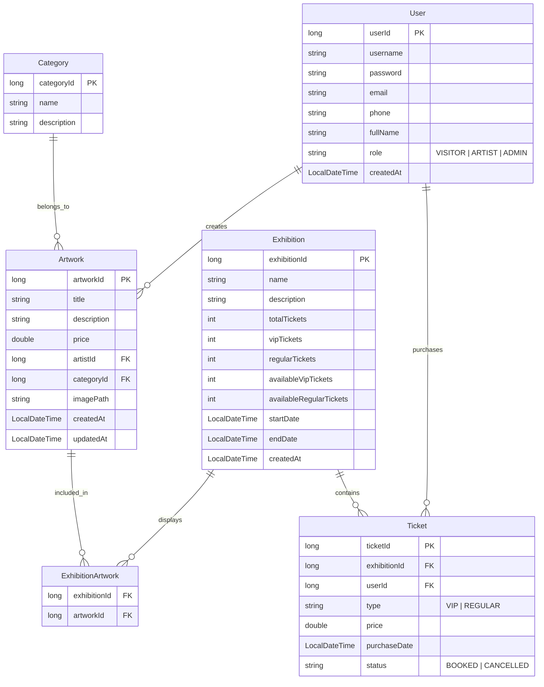

# BÁO CÁO HACKATHON - AI APPLICATION IN ACTION

**Lớp:**  CNTT1
**Họ Tên:** Đinh Trọng An  
**Mã đề:** DE006  
**Repository:** RE12345_DinhTrongAn_Hackathon_AI_DE006

---

## MỤC TIÊU KỸ THUẬT

- **Phần 1:** Áp dụng Strategy Pattern + Dependency Injection để tách biệt chiến lược tính phí, định tuyến và thông báo. Đảm bảo Open/Closed Principle – khi thêm loại chuyển tiền mới chỉ cần implement interface, không sửa code cũ.
- **Phần 2:** Sử dụng AOP với `@RestControllerAdvice` + `@ExceptionHandler` để bắt lỗi tập trung, trả về JSON đồng nhất HTTP 400 thay vì White-label Error Page.
- **Phần 3:** Phân tích nghiệp vụ ArtExhibition, đề xuất Tech Stack (Spring Boot 3 + JPA + MySQL), thiết kế ERD với Mermaid.

---

## PHẦN 1: TÁI CẤU TRÚC HỆ THỐNG (REFACTORING)

### Prompt Chain (Lịch sử Prompt)

**Prompt 1 (Phân tích):**  
> "Hãy phân tích đoạn mã TransferService.processTransfer bên dưới và chỉ ra các vi phạm nguyên tắc SOLID, đặc biệt là Open/Closed Principle. Mỗi lần thêm loại chuyển tiền mới, dev phải sửa hàm processTransfer, gây rủi ro hỏng logic cũ."

**Kết quả:** AI chỉ ra mã vi phạm OCP do dùng if-else chain, khó mở rộng, khó bảo trì. Đề xuất tách thành Strategy Pattern với các interface: `TransferFeeStrategy`, `TransferRouter`, `NotificationSender`.

**Prompt 2 (Thiết kế kiến trúc):**  
> "Dựa trên phân tích, hãy thiết kế lại hệ thống với Strategy Pattern. Tạo các interface: TransferFeeStrategy (tính phí), TransferRouter (định tuyến), NotificationSender (gửi thông báo). Viết các implement cụ thể cho INTERNAL, DOMESTIC_BANK, INTERNATIONAL. Tạo TransferTypeConfig để registry các strategy và TransferService dùng composition."

**Kết quả:** AI sinh mã nguồn hoàn chỉnh với các interface và implement tương ứng.

**Prompt 3 (Mở rộng Notification):**  
> "Bổ sung thêm PushNotificationSender implement NotificationSender. Chỉ ra rằng để chuyển từ SMS sang Push Notification, ta chỉ cần inject implementation khác vào TransferTypeConfig mà không sửa TransferService."

**Kết quả:** Tạo được PushNotificationSender, chứng minh OCP.

### Giải thích kiến trúc

```
TransferService (chỉ phụ thuộc interface)
  ├── TransferFeeStrategy (tính phí)
  │   ├── InternalTransferFee
  │   ├── DomesticBankFee
  │   └── InternationalFee
  ├── TransferRouter (định tuyến)
  │   ├── InternalTransferRouter
  │   ├── DomesticBankRouter
  │   └── InternationalRouter
  └── NotificationSender (thông báo)
      ├── SmsNotificationSender
      └── PushNotificationSender
```

Khi thêm loại chuyển tiền mới (VD: `CRYPTO`): Tạo `CryptoFee` + `CryptoRouter` + đăng ký vào `TransferTypeConfig`. **Không sửa dòng nào trong `TransferService`.**

### Phân tích lỗi AI

**Lỗi:** Ở lần sinh đầu, AI đặt `processTransfer` trong cả `TransferFeeStrategy` lẫn `TransferRouter`, gây trùng lặp trách nhiệm.  
**Cách khắc phục:** Yêu cầu AI tách bạch: `TransferFeeStrategy` chỉ chịu trách nhiệm `calculateFee(amount)`, `TransferRouter` chỉ chịu trách nhiệm `route()`. Điều này tuân đúng Single Responsibility Principle.

---

## PHẦN 2: DEBUGGING BẢO MẬT VÀ XỬ LÝ LỖI

### Root Cause

Nguyên nhân: `UserRegistrationService.registerUser()` ném `IllegalArgumentException` nhưng không có `try-catch` trong `UserController`. Spring Boot mặc định không bắt `IllegalArgumentException` nên nó lan tới `BasicErrorController` và trả về HTTP 500 với White-label Error Page.

### Giải pháp AOP

Sử dụng `@RestControllerAdvice` để bắt lỗi tập trung:

```java
@RestControllerAdvice
public class GlobalExceptionHandler {

    @ExceptionHandler(IllegalArgumentException.class)
    public ResponseEntity<ErrorResponse> handleIllegalArgument(IllegalArgumentException ex) {
        ErrorResponse error = new ErrorResponse("INVALID_INPUT", ex.getMessage());
        return ResponseEntity.status(HttpStatus.BAD_REQUEST).body(error);
    }
}
```

### Tại sao không dùng try-catch rải rác?

- Vi phạm DRY – lặp lại try-catch ở mọi Controller method
- Khó bảo trì – mỗi lần thêm validation mới phải thêm catch block
- Dễ sót lỗi – quên catch sẽ gây 500
- Khó đồng nhất format response

### Prompt Chain

**Prompt 1 (Chẩn đoán):**  
> "Tại sao UserRegistrationService ném IllegalArgumentException nhưng server lại trả về HTTP 500 thay vì 400? Giải thích luồng xử lý exception trong Spring Web MVC."

**Kết quả:** AI giải thích Spring không map `IllegalArgumentException` sang HTTP status nào; nó rơi vào `DefaultHandlerExceptionResolver` rồi ra `BasicErrorController` → 500.

**Prompt 2 (Giải pháp AOP):**  
> "Tạo GlobalExceptionHandler với @RestControllerAdvice bắt IllegalArgumentException, trả về HTTP 400 và JSON format {\"error\": \"INVALID_INPUT\", \"message\": \"...\"}."

**Kết quả:** AI sinh mã GlobalExceptionHandler và ErrorResponse.

**Prompt 3 (Phản biện try-catch):**  
> "Phân tích nhược điểm của việc dùng try-catch rải rác trong từng Controller method so với @RestControllerAdvice. Đưa ra ít nhất 4 lý do."

**Kết quả:** AI đưa ra các lý do về DRY, maintainability, consistency, testability.

---

## PHẦN 3: PHÂN TÍCH VÀ THIẾT KẾ HỆ THỐNG

### Nhiệm vụ 1: Đề xuất Tech Stack

**Prompt:**  
> "Tôi là System Analyst cho dự án ArtExhibition Management – nền tảng web nguyên khối quản lý tác phẩm nghệ thuật, nhân sự và bán vé. Hệ thống có 3 role: Khách tham quan, Họa sĩ, Quản trị viên. Yêu cầu: upload file ảnh tác phẩm, phân trang/tìm kiếm động theo tên/thể loại/khoảng giá, bán vé có hạn với ưu tiên VIP 24h, đảm bảo transaction khi nhiều người cùng mua. Hãy đề xuất Tech Stack phù hợp và giải thích lý do."

**AI đề xuất:**

| Thành phần | Công nghệ | Lý do |
|---|---|---|
| Backend | Java 21 + Spring Boot 3 | Monolithic phù hợp quy mô vừa, cộng đồng lớn |
| ORM | Spring Data JPA (Hibernate) | Hỗ trợ pagination, dynamic search với Specification |
| Database | MySQL 8 | ACID transaction, phù hợp bán vé |
| File Upload | Local filesystem + Spring MultipartFile | Đơn giản, đủ cho MVP |
| Validation | Jakarta Validation + Hibernate Validator | Tích hợp sẵn với Spring Boot |
| Frontend | Thymeleaf / React (tùy chọn) | Thymeleaf cho monolithic nhanh |

**Nhận xét phản biện:**

- **Đồng ý:** Spring Boot + MySQL là lựa chọn an toàn, phù hợp monolithic, hỗ trợ transaction tốt.
- **Phản biện:** AI không đề cập đến caching (Redis) cho việc check số lượng vé còn lại khi có nhiều request đồng thời. Với yêu cầu "nhiều người cùng mua vé", nên thêm Redis + pessimistic locking để tránh oversell. AI cũng không đề cập đến Cloud Storage (S3) cho file ảnh – khi scale lên, lưu file local sẽ là bottleneck.

### Nhiệm vụ 2: Phân tích Thực thể (Entity Analysis)

**Prompt:**  
> "Dựa trên nghiệp vụ ArtExhibition Management: (1) Quản lý người dùng với 3 role, (2) Quản lý tác phẩm có upload ảnh, phân trang, tìm kiếm động, (3) Bán vé có hạn, VIP ưu tiên 24h, đảm bảo transaction. Hãy xác định các thực thể cốt lõi và thuộc tính. Không dùng kiểu mảng/array trong cấu trúc lưu trữ."

**Danh sách Entities:**

| Entity | Thuộc tính chính |
|---|---|
| **User** | userId, username, password, email, phone, fullName, role (VISITOR/ARTIST/ADMIN) |
| **Artwork** | artworkId, title, description, price, imagePath, artistId (FK), categoryId (FK) |
| **Category** | categoryId, name, description |
| **Exhibition** | exhibitionId, name, description, totalTickets, vipTickets, regularTickets, availableVipTickets, availableRegularTickets, startDate, endDate |
| **Ticket** | ticketId, exhibitionId (FK), userId (FK), type (VIP/REGULAR), price, purchaseDate, status (BOOKED/CANCELLED) |
| **ExhibitionArtwork** | exhibitionId (FK), artworkId (FK) – bảng trung gian Many-to-Many |

### Nhiệm vụ 3: Thiết kế ERD

**Prompt:**  
> "Dựa trên các entities đã chốt ở bước trên, hãy tạo mã Mermaid erDiagram để vẽ sơ đồ quan hệ thực thể (ERD). Bao gồm tất cả entities, thuộc tính, khóa chính, khóa ngoại và relationships."

**Mã Mermaid:**



**Hình ảnh ERD:** Xem tại `docs/erd_diagram.png`

---

## CẤU TRÚC THƯ MỤC

```
RE12345_DinhTrongAn_Hackathon_AI_DE006
├── src/
│   ├── main/java/
│   │   ├── refactoring/          # Mã nguồn tái cấu trúc (Phần 1)
│   │   │   ├── Account.java
│   │   │   ├── Transaction.java
│   │   │   ├── TransferFeeStrategy.java
│   │   │   ├── TransferRouter.java
│   │   │   ├── NotificationSender.java
│   │   │   ├── InternalTransferFee.java
│   │   │   ├── DomesticBankFee.java
│   │   │   ├── InternationalFee.java
│   │   │   ├── InternalTransferRouter.java
│   │   │   ├── DomesticBankRouter.java
│   │   │   ├── InternationalRouter.java
│   │   │   ├── SmsNotificationSender.java
│   │   │   ├── PushNotificationSender.java
│   │   │   ├── TransferTypeConfig.java
│   │   │   └── TransferService.java
│   │   └── exception/            # Mã nguồn xử lý lỗi AOP (Phần 2)
│   │       ├── UserRequest.java
│   │       ├── User.java
│   │       ├── UserRegistrationService.java
│   │       ├── ErrorResponse.java
│   │       ├── GlobalExceptionHandler.java
│   │       └── UserController.java
│   ├── main/resources/
│   └── test/
├── docs/
│   ├── erd_diagram.mmd           # Mã Mermaid ERD
│   └── erd_diagram.png           # Hình ảnh ERD
├── .gitignore
├── build.gradle
└── README.md
```
